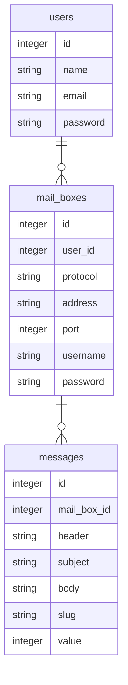

# pseudomailbin

LaravelとReactのサンプル用として立ち上げ。  
開発者がメール送信のテストに使用するサイト、[mailtrap.io](https://mailtrap.io) を真似てみた。  
技術サンプル用なので、実用まで持っていくかどうかは未定。  

* Laravel
* React
* Tailwindcss

#### 使用方法
```shell
npm install
touch database/database.sqlite
egrep -v '^DB' .env.example > .env
echo 'DB_CONNECTION=sqlite' >> .env
php artisan migrate
```

(編集する場合、バックグラウンドで)
```shell
npm run watch
```

試験用サーバ立ち上げ
```shell
php artisan serve
```

ブラウザアクセス: http://localhost:8000
(自動リロードなし)

Register 画面で最初にユーザ登録を行う。

#### 進捗(2022/05/21): 
* Reactのみで一旦簡単なサンプルアプリ作成(tag: react_crash_cource)
* 一度リセットして、一旦Laravel(blade)で画面の大枠を作成
* 画面遷移はそのままで各ページの必要な部分だけReact化
  * 設定ページ作成中

各ページ上にReactのComponentを載せるやり方で作ってみたが、全体をReact化するのに比べてメリットがあるのか不明。  
  
BladeとLaravelの画面遷移を残していると、Reactから関数を渡すのに下の`setGlobal`のようないらぬ工夫が必要になってくる。　 
laravel mix を使用するとexportが出来ないので。  
このあたり他にうまい方法があれば良いが。  

```JavaScript
import React from 'react';
import ReactDOM from 'react-dom/client';
import MailBoxSettings from './components/MailBoxSettings'
import ServerSetting from './components/ServerSettings'

function showMailBoxSettings(id, setDataCB, refreshCredentialCB, addMailBoxCB, deleteMailBoxCB, selectCB) {
    ReactDOM.createRoot(document.getElementById(id)).render(
        <React.StrictMode>
            <MailBoxSettings 
                setDataCB={setDataCB}
                refreshCredentialCB={refreshCredentialCB} 
                addMailBoxCB={addMailBoxCB} 
                deleteMailBoxCB={deleteMailBoxCB} 
                selectCB={selectCB} />
        </React.StrictMode>
    );
}

function showServerSettings(id, address, port) {
    ReactDOM.createRoot(document.getElementById(id)).render(
        <React.StrictMode>
            <ServerSetting address={address} port={port} />
        </React.StrictMode>
    );
}

setGlobal('showMailBoxSettings', showMailBoxSettings)
setGlobal('showServerSettings', showServerSettings)

```

### データベース

