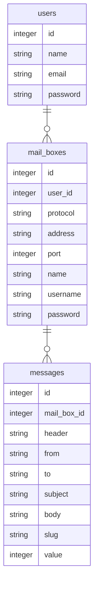

# pseudomailbin

LaravelとReactのサンプル用として立ち上げ。  
開発者がメール送信のテストに使用するサイト、[mailtrap.io](https://mailtrap.io) を真似てみた。  
技術サンプル用なので、実用まで持っていくかどうかは未定。  

* Laravel
* React
* Tailwindcss

#### 使用方法
```shell
npm install
touch database/database.sqlite
egrep -v '^DB' .env.example > .env
echo 'DB_CONNECTION=sqlite' >> .env
php artisan migrate
```

(ダミーメールボックス作成、ユーザ作成後、ユーザIDが１の場合)
```shell
php artisan tinker
App\Models\MailBox::factory()->times(3)->create(['user_id' => 1])
```

(ダミーメッセージ作成、メールボックス作成後、メールボックスIDが 1 の場合)
```shell
php artisan tinker
App\Models\Message::factory()->times(100)->create(['mail_box_id' => 1])
```

(フロント側ソールを編集する場合、バックグラウンドで)
```shell
npm run watch
```

試験用サーバ立ち上げ
```shell
php artisan serve
```

ブラウザアクセス: http://localhost:8000
(自動リロードなし)

Register 画面で最初にユーザ登録を行う。

#### 進捗(2022/06/02): 
* Reactのみで一旦簡単なサンプルアプリ作成(tag: react_crash_cource)
* 一度リセットして、一旦Laravel(blade)で画面の大枠を作成
* 画面遷移はそのままで各ページの必要な部分だけReact化
  * 設定ページ作成
  * メールボックスページ作成中

各ページ上の部分部分にReactDomを置くやり方で作っているが、全体をReact化するのに比べてメリットがあるのか不明。  

### データベース



