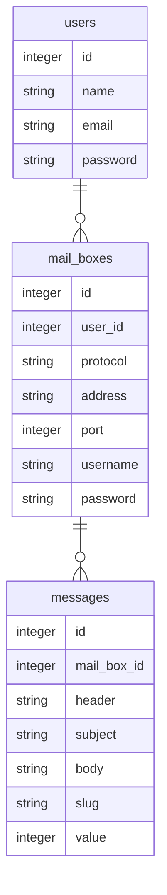

# pseudomailbin

LaravelとReactの学習用に立ち上げ。  
開発者がメール送信のテストに使用するサイト、mailtrap.io を真似てみた。  
学習用なので、実用まで持っていくかどうかは未定。  

進捗(2022/05/21): 
  * 一旦Laravel(blade)で画面の大枠を作成
  * 画面遷移はそのままで各ページの必要な部分だけReact化
    -> 設定ページ作成中

### データベース

