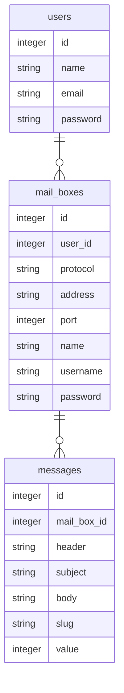

# pseudomailbin

LaravelとReactのサンプル用として立ち上げ。  
開発者がメール送信のテストに使用するサイト、[mailtrap.io](https://mailtrap.io) を真似てみた。  
技術サンプル用なので、実用まで持っていくかどうかは未定。  

* Laravel
* React
* Tailwindcss

#### 使用方法
```shell
npm install
touch database/database.sqlite
egrep -v '^DB' .env.example > .env
echo 'DB_CONNECTION=sqlite' >> .env
php artisan migrate
```

(ダミーメールボックス作成)
```shell
php artisan tinker
App\Models\MailBox::factory()->times(3)->create(['user_id' => 1])
```

(編集する場合、バックグラウンドで)
```shell
npm run watch
```

試験用サーバ立ち上げ
```shell
php artisan serve
```

ブラウザアクセス: http://localhost:8000
(自動リロードなし)

Register 画面で最初にユーザ登録を行う。

#### 進捗(2022/05/25): 
* Reactのみで一旦簡単なサンプルアプリ作成(tag: react_crash_cource)
* 一度リセットして、一旦Laravel(blade)で画面の大枠を作成
* 画面遷移はそのままで各ページの必要な部分だけReact化
  * 設定ページ作成中

各ページ上にReactのComponentを載せるやり方で作ってみたが、全体をReact化するのに比べてメリットがあるのか不明。  

Laravelによる画面遷移を残しつつ、React の componentを使用するやり方を試しているが、認証で少々無駄な処理が入ってしまう。  
Login画面でFormを使用して認証を行い、ログインすると画面遷移する仕組みの上に、ReactからAPIを使用する仕組みを追加したが、どうしても認証を2回通すやり方になってしまう。  
1回目は api 認証を行い、その後 form をsubmitする。  
api認証後のtokenはsessionStorageに保存。  
form認証の結果はcookieに保存される。  

という方法で、画面遷移とJSからのfetch()の両立をおこなった。  
他に良い方法があれば良いが。  

### データベース

