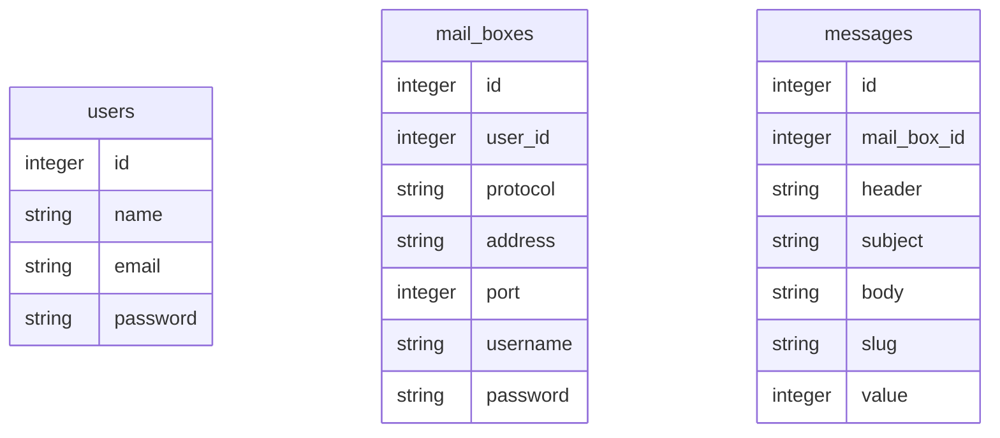

# pseudomailbin

webapp for mail sending test (like mailtrap.io).  

(This project is just for studying Laravel/React/etc., not for proctical use)

```mermaid
erDiagram

users {
    integer id
    string name
    string email
    string password
}

mail_boxes {
    integer id
    integer user_id
    string protocol
    string address
    integer port
    string username
    string password
}

messages {
    integer id
    integer mail_box_id
    string header
    string subject
    string body
    string slug
    integer value
}
```